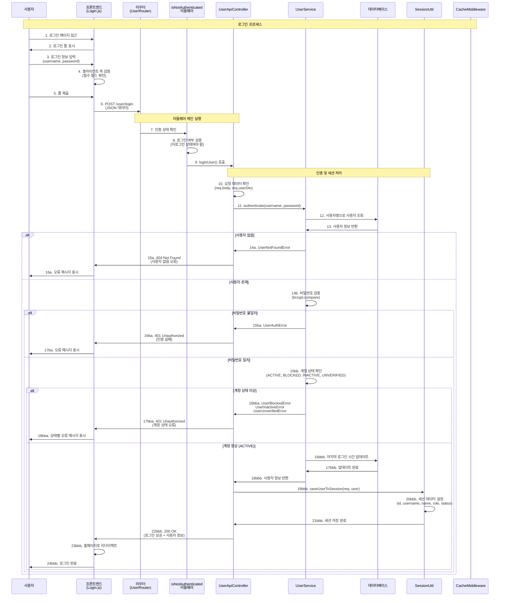
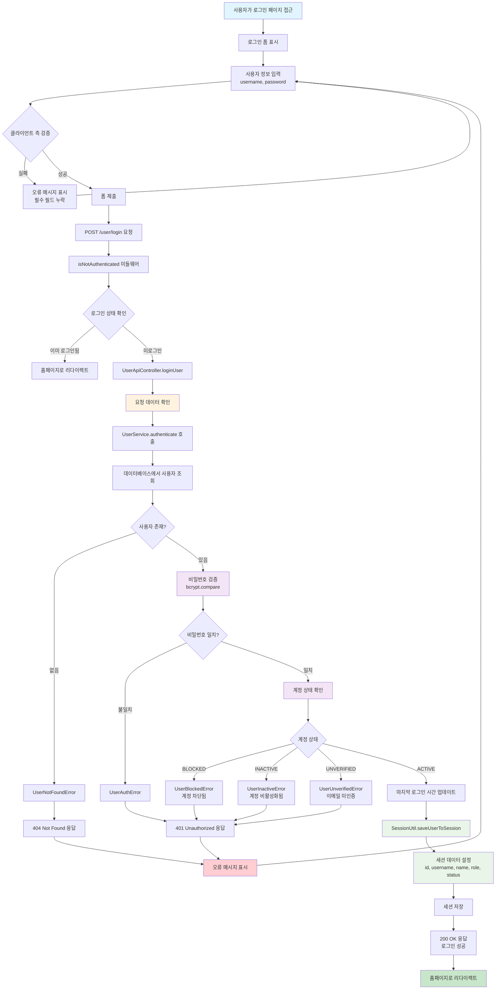
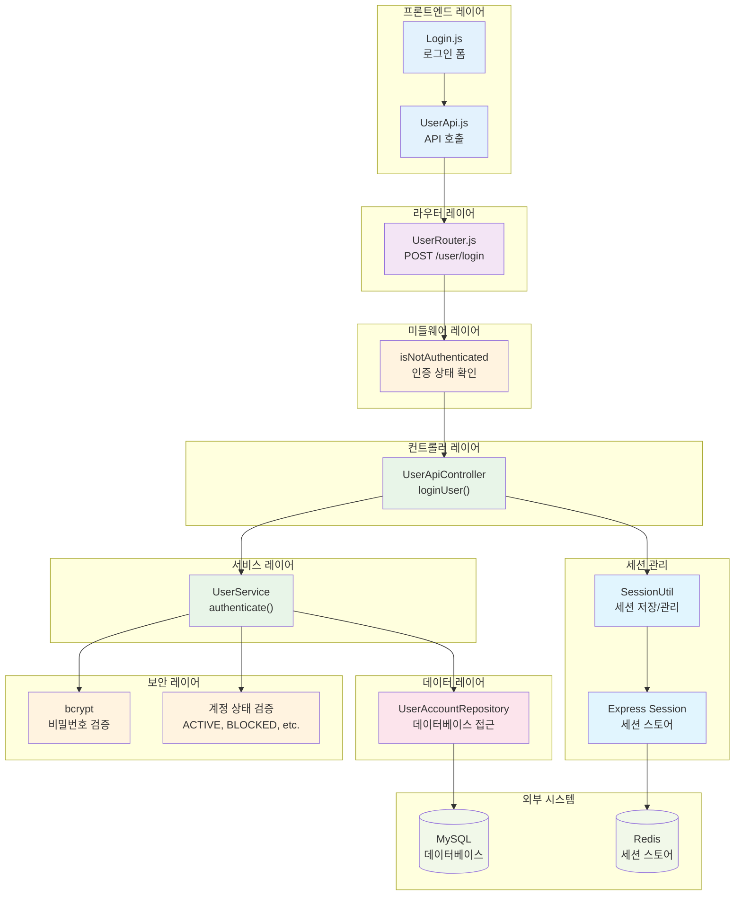

# SKKU Fine Art Club Gallery - 로그인 시스템 문서

## 1. 로그인 시퀀스 다이어그램

사용자가 로그인을 진행하는 전체 과정을 시간 순서대로 보여줍니다.



## 2. 로그인 플로우차트

로그인 과정의 의사결정 지점과 분기를 명확하게 보여줍니다.



## 3. 시스템 아키텍처 다이어그램

로그인 기능과 관련된 시스템 컴포넌트들의 구조와 관계를 보여줍니다.



## 4. 주요 컴포넌트 설명

### 4.1 프론트엔드 레이어
- **Login.js**: 로그인 폼 UI 및 클라이언트 측 검증 로직
- **UserApi.js**: 백엔드 API와의 통신을 담당하는 API 클라이언트

### 4.2 미들웨어 레이어
- **isNotAuthenticated**: 사용자가 로그인하지 않은 상태인지 확인

### 4.3 비즈니스 로직 레이어
- **UserApiController**: HTTP 요청/응답 처리 및 에러 핸들링
- **UserService**: 로그인 비즈니스 로직 (사용자 인증, 계정 상태 확인)

### 4.4 데이터 레이어
- **UserAccountRepository**: 데이터베이스 CRUD 작업

### 4.5 세션 관리
- **SessionUtil**: 세션 데이터 저장 및 관리 유틸리티
- **Express Session**: 세션 미들웨어 및 스토어

### 4.6 보안 레이어
- **bcrypt**: 비밀번호 해싱 및 검증
- **계정 상태 검증**: 사용자 계정 상태 확인 로직

## 5. 보안 및 검증 단계

### 5.1 클라이언트 측 검증
- 필수 필드 입력 확인 (username, password)
- 빈 값 검증

### 5.2 서버 측 보안
- **인증 상태 확인**: 미로그인 사용자만 로그인 가능
- **비밀번호 검증**: bcrypt를 사용한 안전한 비밀번호 비교
- **계정 상태 검증**: ACTIVE, BLOCKED, INACTIVE, UNVERIFIED 상태 확인
- **세션 보안**: 안전한 세션 데이터 저장

### 5.3 데이터 보안
- 비밀번호 평문 전송 방지
- 세션 데이터 최소화 (민감 정보 제외)
- 로그인 시간 추적

## 6. 에러 처리

### 6.1 클라이언트 에러 (400번대)
- **404 Not Found**:
  - UserNotFoundError: 존재하지 않는 사용자
- **401 Unauthorized**:
  - UserAuthError: 비밀번호 불일치
  - UserBlockedError: 계정 차단됨
  - UserInactiveError: 계정 비활성화됨
  - UserUnverifiedError: 이메일 미인증
- **500 Internal Server Error**: 서버 내부 오류

### 6.2 에러 메시지 처리
- Message.USER 상수를 통한 일관된 메시지 관리
- ApiResponse.error()를 통한 표준화된 에러 응답
- Logger를 통한 상세한 에러 로깅

## 7. 계정 상태별 처리

### 7.1 계정 상태 종류
- **ACTIVE**: 정상 활성 계정 (로그인 허용)
- **BLOCKED**: 차단된 계정 (로그인 거부)
- **INACTIVE**: 비활성화된 계정 (로그인 거부)
- **UNVERIFIED**: 이메일 미인증 계정 (로그인 거부)

### 7.2 상태별 메시지
```javascript
// 계정 상태별 에러 메시지
BLOCKED: '계정이 차단되었습니다. 관리자에게 문의하세요.'
INACTIVE: '계정이 비활성화되었습니다. 관리자에게 문의하세요.'
UNVERIFIED: '이메일 인증이 완료되지 않았습니다. 이메일을 확인해주세요.'
```

## 8. 세션 관리

### 8.1 세션 데이터 구조
```javascript
req.session.user = {
    id: user.id,
    username: user.username,
    name: user.name,
    role: user.role,
    status: user.status,
    isAdmin: user.role === 'ADMIN'
};
```

### 8.2 세션 보안
- 민감한 정보 (비밀번호, 이메일 등) 세션에 저장하지 않음
- 필요한 최소한의 정보만 세션에 저장
- 세션 만료 시간 설정

### 8.3 세션 저장 과정
1. 로그인 성공 후 SessionUtil.saveUserToSession() 호출
2. 세션 데이터 설정
3. req.session.save()를 통한 세션 저장
4. Redis 또는 메모리 스토어에 세션 데이터 저장

## 9. 성능 최적화

### 9.1 데이터베이스 최적화
- 사용자명 인덱스를 통한 빠른 조회
- 필요한 필드만 선택적 조회

### 9.2 세션 최적화
- Redis를 통한 세션 스토어 사용
- 세션 데이터 최소화

### 9.3 보안 최적화
- bcrypt를 통한 안전한 비밀번호 검증
- 로그인 시도 제한 (향후 구현 가능)

## 10. 사용자 경험 (UX)

### 10.1 실시간 피드백
- 입력 필드별 실시간 검증
- 명확한 오류 메시지 제공
- 로딩 상태 표시

### 10.2 접근성
- 키보드 네비게이션 지원
- 스크린 리더 호환성
- 명확한 라벨 및 오류 메시지

### 10.3 반응형 디자인
- 모바일 및 데스크톱 환경 지원
- 터치 친화적 인터페이스

## 11. 개발자 가이드

### 11.1 인증 로직 구현
```javascript
// UserService.authenticate() 메서드 예시
async authenticate(username, password) {
    const user = await this.userRepository.findUserByUsername(username);

    if (!user) {
        throw new UserNotFoundError('아이디 또는 비밀번호가 일치하지 않습니다.');
    }

    const isPasswordValid = await bcrypt.compare(password, user.password);
    if (!isPasswordValid) {
        throw new UserAuthError('아이디 또는 비밀번호가 일치하지 않습니다.');
    }

    // 계정 상태 확인
    if (user.status !== 'ACTIVE') {
        throw new UserInactiveError('로그인할 수 없는 계정 상태입니다.');
    }

    return user;
}
```

### 11.2 세션 관리 구현
```javascript
// 세션 저장
await SessionUtil.saveUserToSession(req, user);

// 세션 확인
if (req.session.user) {
    // 로그인된 사용자
}

// 세션 삭제 (로그아웃)
await SessionUtil.destroySession(req);
```

### 11.3 에러 처리 패턴
```javascript
try {
    const user = await this.userService.authenticate(username, password);
    await SessionUtil.saveUserToSession(req, user);
    return res.json(ApiResponse.success(user, Message.USER.LOGIN_SUCCESS));
} catch (error) {
    if (error instanceof UserNotFoundError) {
        return res.status(404).json(ApiResponse.error(Message.USER.NOT_FOUND));
    } else if (error instanceof UserAuthError) {
        return res.status(401).json(ApiResponse.error(Message.USER.AUTH_ERROR));
    }
    // 기타 에러 처리...
}
```

## 12. 로깅 및 모니터링

### 12.1 로그인 로깅
- 로그인 시도 기록
- 로그인 성공/실패 로그
- 계정 상태별 로그인 거부 기록

### 12.2 보안 모니터링
- 반복적인 로그인 실패 감지
- 비정상적인 로그인 패턴 감지
- 계정 상태 변경 이력 추적

## 13. 테스트 전략

### 13.1 단위 테스트
- UserService.authenticate() 메서드 테스트
- 비밀번호 검증 로직 테스트
- 계정 상태별 에러 처리 테스트

### 13.2 통합 테스트
- 전체 로그인 플로우 테스트
- 세션 관리 테스트
- 데이터베이스 연동 테스트

### 13.3 E2E 테스트
- 브라우저 기반 로그인 시나리오 테스트
- 다양한 계정 상태별 로그인 테스트
- 에러 상황 처리 테스트

## 14. 보안 고려사항

### 14.1 비밀번호 보안
- bcrypt를 사용한 안전한 비밀번호 검증
- 비밀번호 평문 로깅 금지
- 타이밍 공격 방지

### 14.2 세션 보안
- 세션 하이재킹 방지
- 세션 고정 공격 방지
- 적절한 세션 만료 시간 설정

### 14.3 브루트 포스 공격 방지
- 로그인 시도 제한 (향후 구현)
- 계정 잠금 기능 (향후 구현)
- CAPTCHA 도입 고려
