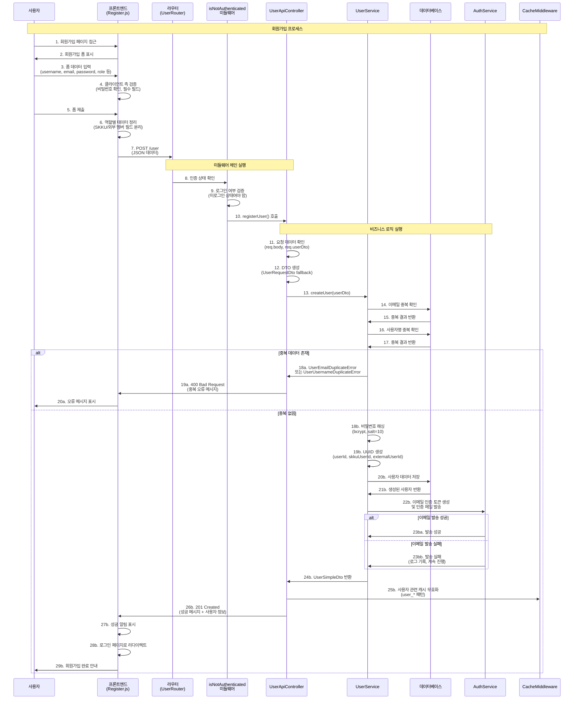
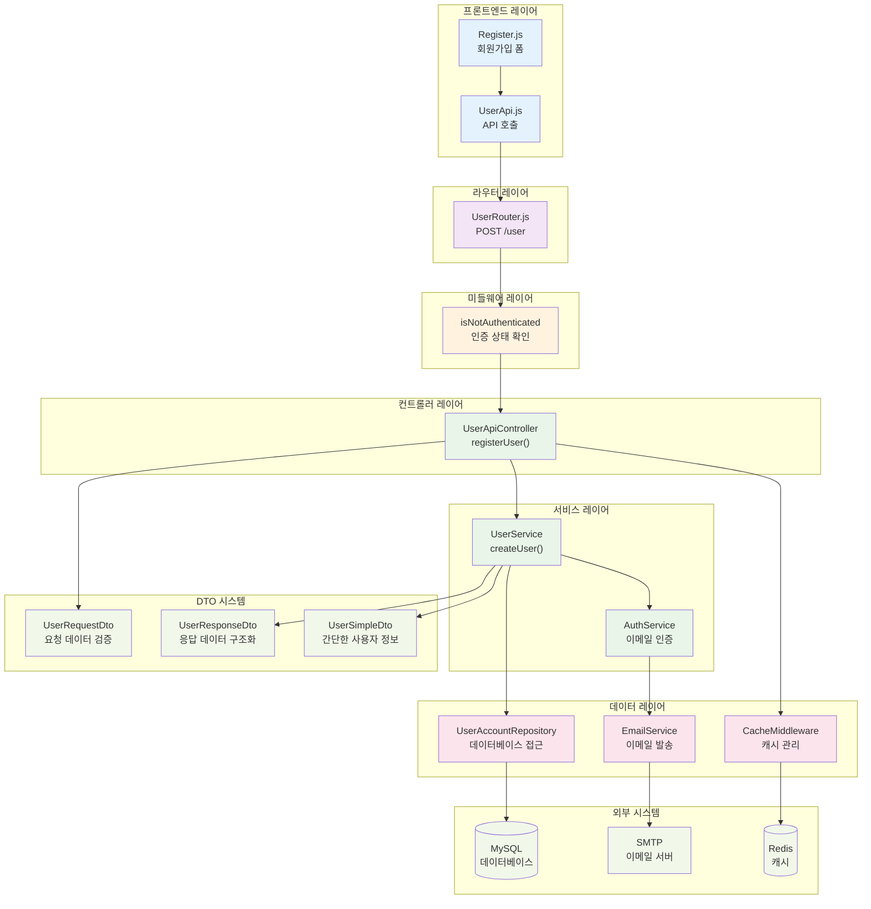

# SKKU Fine Art Club Gallery - 회원가입 시스템 문서

## 1. 회원가입 시퀀스 다이어그램

사용자가 회원가입을 진행하는 전체 과정을 시간 순서대로 보여줍니다.



## 2. 회원가입 플로우차트

회원가입 과정의 의사결정 지점과 분기를 명확하게 보여줍니다.

```mermaid
flowchart TD
    A[사용자가 회원가입 페이지 접근] --> B[회원가입 폼 표시]
    B --> C[사용자 정보 입력]
    C --> D{클라이언트 측 검증}
    D -->|실패| E[오류 메시지 표시]
    E --> C
    D -->|성공| F[폼 제출]

    F --> G[POST /user 요청]
    G --> H[isNotAuthenticated 미들웨어]
    H --> I{로그인 상태 확인}
    I -->|로그인됨| J[홈페이지로 리다이렉트]
    I -->|미로그인| K[UserApiController.registerUser]

    K --> L[요청 데이터 확인]
    L --> M{DTO 존재 여부}
    M -->|없음| N[Fallback DTO 생성<br/>(UserRequestDto)]
    M -->|있음| O[검증된 DTO 사용]
    N --> P[UserService.createUser]
    O --> P

    P --> Q[이메일 중복 확인]
    Q --> R{이메일 중복?}
    R -->|예| S[UserEmailDuplicateError]
    R -->|아니오| T[사용자명 중복 확인]
    T --> U{사용자명 중복?}
    U -->|예| V[UserUsernameDuplicateError]
    U -->|아니오| W[비밀번호 해싱]

    W --> X[UUID 생성]
    X --> Y[데이터베이스에 사용자 저장]
    Y --> Z[AuthService 이메일 인증]
    Z --> AA{이메일 발송 결과}
    AA -->|실패| BB[로그 기록<br/>계속 진행]
    AA -->|성공| CC[발송 완료]

    BB --> DD[UserSimpleDto 생성]
    CC --> DD
    DD --> EE[캐시 무효화]
    EE --> FF[201 Created 응답]
    FF --> GG[성공 메시지 표시]
    GG --> HH[로그인 페이지로 리다이렉트]

    S --> II[400 Bad Request 응답]
    V --> II
    II --> JJ[오류 메시지 표시]
    JJ --> C

    style A fill:#e1f5fe
    style HH fill:#c8e6c9
    style JJ fill:#ffcdd2
    style L fill:#fff3e0
    style W fill:#f3e5f5
    style Y fill:#f3e5f5
    style Z fill:#e8f5e8
```

## 3. 시스템 아키텍처 다이어그램

회원가입 기능과 관련된 시스템 컴포넌트들의 구조와 관계를 보여줍니다.



## 4. 주요 컴포넌트 설명

### 4.1 프론트엔드 레이어
- **Register.js**: 회원가입 폼 UI 및 클라이언트 측 검증 로직
- **UserApi.js**: 백엔드 API와의 통신을 담당하는 API 클라이언트

### 4.2 미들웨어 레이어
- **isNotAuthenticated**: 사용자가 로그인하지 않은 상태인지 확인
- **CacheMiddleware**: Redis를 통한 캐시 관리 및 무효화

### 4.3 비즈니스 로직 레이어
- **UserApiController**: HTTP 요청/응답 처리 및 에러 핸들링
- **UserService**: 회원가입 비즈니스 로직 (중복 확인, 비밀번호 해싱, 사용자 생성)
- **AuthService**: 이메일 인증 토큰 생성 및 인증 메일 발송

### 4.4 데이터 레이어
- **UserAccountRepository**: 데이터베이스 CRUD 작업
- **EmailService**: SMTP를 통한 이메일 발송
- **CacheMiddleware**: Redis를 통한 캐시 관리

### 4.5 DTO 시스템
- **UserRequestDto**: 클라이언트 요청 데이터 검증 및 구조화
- **UserResponseDto**: API 응답 데이터 구조화
- **UserSimpleDto**: 간단한 사용자 정보 전달

## 5. 보안 및 검증 단계

### 5.1 클라이언트 측 검증
- 필수 필드 입력 확인
- 비밀번호 확인 일치 검증
- 이메일 형식 검증
- 역할별 필드 조건부 검증

### 5.2 서버 측 보안
- **인증 상태 확인**: 미로그인 사용자만 회원가입 가능
- **DTO 기반 검증**: UserRequestDto를 통한 강타입 검증
- **비밀번호 해싱**: bcrypt를 사용한 안전한 비밀번호 저장
- **UUID 기반 식별자**: 예측 불가능한 고유 식별자 생성

### 5.3 데이터 무결성
- 이메일 중복 확인
- 사용자명 중복 확인
- 트랜잭션 기반 데이터 일관성 보장
- 역할별 필드 검증 (SKKU_MEMBER, EXTERNAL_MEMBER)

## 6. 에러 처리

### 6.1 클라이언트 에러 (400번대)
- **400 Bad Request**:
  - UserEmailDuplicateError: 이메일 중복
  - UserUsernameDuplicateError: 사용자명 중복
  - UserValidationError: 입력 데이터 검증 실패
- **401 Unauthorized**: 인증 관련 오류
- **500 Internal Server Error**: 서버 내부 오류

### 6.2 에러 메시지 처리
- Message.USER 상수를 통한 일관된 메시지 관리
- ApiResponse.error()를 통한 표준화된 에러 응답
- Logger를 통한 상세한 에러 로깅

## 7. 성능 최적화

### 7.1 병렬 처리
- 이메일 및 사용자명 중복 확인을 순차적으로 실행하여 불필요한 DB 쿼리 방지

### 7.2 캐시 관리
- 회원가입 완료 후 사용자 관련 캐시 무효화 (user_* 패턴)
- Redis를 통한 세션 및 인증 토큰 관리

### 7.3 비동기 처리
- 이메일 발송을 비동기로 처리하여 응답 시간 단축
- 이메일 발송 실패 시에도 회원가입 프로세스 계속 진행

## 8. 사용자 경험 (UX)

### 8.1 실시간 피드백
- 입력 필드별 실시간 검증 및 오류 표시
- 비밀번호 강도 표시
- 역할 선택에 따른 동적 필드 표시/숨김

### 8.2 접근성
- 키보드 네비게이션 지원
- 스크린 리더 호환성
- 명확한 오류 메시지 제공

### 8.3 반응형 디자인
- 모바일 및 데스크톱 환경 지원
- 터치 친화적 인터페이스

## 9. 개발자 가이드

### 9.1 DTO 시스템 활용
```javascript
// UserRequestDto 사용 예시
const userDto = new UserRequestDto({
    username,
    name,
    email,
    password,
    role,
    department: role === 'SKKU_MEMBER' ? department : null,
    isClubMember: role === 'SKKU_MEMBER' ? isClubMember : false,
    studentYear: role === 'SKKU_MEMBER' ? studentYear : null,
    affiliation: role === 'EXTERNAL_MEMBER' ? affiliation : null
});
```

### 9.2 에러 처리 패턴
```javascript
try {
    const createdUser = await this.userService.createUser(userDto);
    return res.status(201).json(ApiResponse.success(userResponseDto, successMessage));
} catch (error) {
    if (error instanceof UserEmailDuplicateError) {
        return res.status(400).json(ApiResponse.error(Message.USER.DUPLICATE_EMAIL_ERROR));
    }
    // 기타 에러 처리...
}
```

### 9.3 로깅 및 디버깅
- Logger.withContext(req)를 통한 컨텍스트 기반 로깅
- 요청 데이터 디버깅을 위한 console.log 활용
- 에러 스택 트레이스 및 상세 정보 기록

## 10. 테스트 전략

### 10.1 단위 테스트
- UserService.createUser() 메서드 테스트
- DTO 검증 로직 테스트
- 에러 처리 시나리오 테스트

### 10.2 통합 테스트
- 전체 회원가입 플로우 테스트
- 데이터베이스 연동 테스트
- 이메일 발송 기능 테스트

### 10.3 E2E 테스트
- 브라우저 기반 회원가입 시나리오 테스트
- 다양한 역할별 회원가입 테스트
- 에러 상황 처리 테스트
